# Project最终报告

---

| 课程名称 | 区块链原理与技术 | 任课老师 | 郑子彬 |
| :------------: | :-------------: | :------------: | :-------------: |
| 年级 | 16级 | 专业（方向） | 软件工程（数字媒体）|
| 学号 | 16340255 | 姓名 | 谢涛 |
| 电话 | 13670828568 | Email | 1176748429@qq.com |
| 开始日期 | 2018-12-26 | 完成日期 | 2018-12-30 |

---

[TOC]

## 1. 所有源码Github地址

[https://github.com/gitgiter/Solidity-SuperCommunity](https://github.com/gitgiter/Solidity-SuperCommunity)

## 2. 选题背景、依据

### 2.1 软件题目
区块链超社区 

### 2.2 选题构思与背景
原则上按照开题报告中写的需求进行实现。

> 这将是一款基于区块链技术开发的超社交平台，致力于将区块链的一些优良特性，如匿名性、信息不可篡改性、去中心化等，运用到超社交领域中，所谓超社交领域，顾名思义就是不仅限于社交的领域，意味着用户们可以在这个平台上做很多事情，比如最基本的 信息交流，然后是其他一些额外功能如拍卖商品，慈善活动，游戏互动等，它具有众多功能和良好的扩展性（开发过程中可以很方便地增加或删除一些功能）。 

> 注：这种基于区块链技术的匿名言论体系能带来一个好处就是，可以减少用户发表一些没 有价值的观点或问题。这些言论主要是交流一些技术上、学习上、生活上的问题和观点，用户会自觉地避免发表一些没有价值的问题和观点，共同打造高质量、高素质、高水平的社区。毕竟发表匿名言论是需要付出一定的代价的，至少用户会认为他的言论带来的价值会比他所付出的代价要高。 

由于实际实现原因做了一些调整。

最终实现的功能如下：
- **功能 1（基本功能）：匿名社区**。 
由于各种原因，现在社会上许多人不太愿意在一些公众场合发表自己的观点或问题，可能是害羞，可能是怕自己的观点或问题被人笑话，也可能是不想引人关注等等，这样其实可能会导致公众失去一些接收新鲜的、有意义、有想法的观点的机会，同时也会使得某些有价值的问题失去集思广益的机会。  

- **功能 2：关注用户**。
在这个社区内，每个用户都有一个由自己定义的、便于记忆且唯一的用户名，解决了哈希账户名难记的问题，同时允许用户在区块链上面建立一种匿名的社交关系，每个用户可以与其他区块链用户建立匿名的好友关系，可以关注好友的动态并与好友互动，都可以自由发表言论以及查看社区或好友中已发表的言论。  

- **功能 3：打赏功能**。 
前面提到，因为发表匿名言论需要代价，对于提出问题的用户我们可以理解，但我们有理 由考虑到有些回答别人问题的用户可能不愿意在发表观点的同时还需要自己付出代价。因此， 这里需要一个激励机制，那便是可以点赞或打赏，发表观点的用户有机会获得来自其他因该观点获益的用户打赏（包括问题提出者），打赏额度可由获益用户自己决定。 

- **功能 4：互发重要邮件**。 
用户可以向其他区块链用户发送重要邮件，这些邮件不会丢失，也不会被篡改，安全性和 可靠性有区块链技术提供的支撑和保障。为此发送邮件的用户可能需要支付一定的金钱。 

- **功能 5：公开透明的慈善机构**。 
公开的社区慈善基金池，该基金池的账户由社区管理员管理，并自动在社区中记录每一笔捐款和支出，无黑箱操作。**最终没想到合适的UI，加上逻辑较简单（就捐入和捐出），因此暂未开发。**

- **功能 6：游戏互动**。 
设计一些竞赛类的区块链游戏，社区用户可以头脑风暴或者比赛娱乐，分数高者可以获得奖励等。每个用户参与游戏需要支付一定的参加费，用于游戏运行和维护，以及对高分者的奖励。 **这里设计了一个简单的竞猜游戏**。


## 3. 使用说明与测试（应有截图与说明）

### 3.1 配置区块链开发环境
网上有许多教程，这里使用truffle。有npm就直接：

- truffle。安装到全局。
```sh
npm install -g truffle
```

- web3。可npm另外装也可以不装，可以不装是因为后面truffle unbox的时候会自动下一个web3的局部依赖，如果用npm的命令则为（默认装最新版）：
```sh
npm install -g web3
```

- 说明：这次开发最终制品时，truffle的编译内核版本提升到0.5.0了，会导致之前的代码就不能用。有两个解决方案：一是回退编译内核版本，二是更改合约代码直至符合0.5.0+规范。这里为了可扩展性，我选择的是后者。0.5.0最主要的特性就是把address类型拆成了普通的address和address payable，只有后者transfer等交易属性。

### 3.2 使用truffle框架进行开发——基于webpack

- 初始化一个空文件夹后进入文件夹，安装webpack。
```sh
truffle unbox webpack
```

- 效果

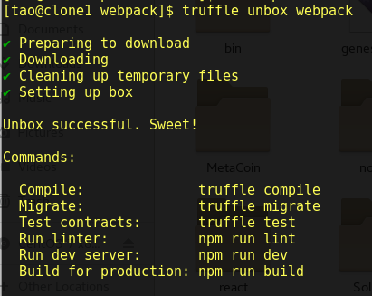

- 进入开发环境
```sh
truffle develop

or

truffle dev
```

- 编译、移植（可在dev环境中，也可在外部，这里在dev环境中进行）
```sh
(dev)> compile
(dev)> migrate
(dev)> migrate --reset # 重新部署合约
```

### 3.3 基于webpack进行Dapp开发
truffle develop的接口测试结果也已在部署报告给出，这里不再展示。前端实现过程也比较冗长和繁琐，这里不作详细说明。只展示最主要的合约交互方式。

- 引入并检测web3。同时引入样式和合约。
```js
// Import the page's CSS. Webpack will know what to do with it.
import '../styles/app.css'

// Import libraries we need.
import { default as Web3 } from 'web3'
import { default as contract } from 'truffle-contract'

// Import our contract artifacts and turn them into usable abstractions.
import superCommunityArtifact from '../../build/contracts/SuperCommunity.json'

// SuperCommunity is our usable abstraction, which we'll use through the code below.
const SuperCommunity = contract(superCommunityArtifact)

// The following code is simple to show off interacting with your contracts.
// As your needs grow you will likely need to change its form and structure.
// For application bootstrapping, check out window.addEventListener below.

...

window.App = App

window.addEventListener('load', function () {
  // Checking if Web3 has been injected by the browser (Mist/MetaMask)
  if (typeof web3 !== 'undefined') {
    console.warn(
      'Using web3 detected from external source.' +
      ' If you find that your accounts don\'t appear or you have 0 SuperCommunity,' +
      ' ensure you\'ve configured that source properly.' +
      ' If using MetaMask, see the following link.' +
      ' Feel free to delete this warning. :)' +
      ' http://truffleframework.com/tutorials/truffle-and-metamask'
    )
    // Use Mist/MetaMask's provider
    window.web3 = new Web3(web3.currentProvider)
  } else {
    console.warn(
      'No web3 detected. Falling back to http://127.0.0.1:9545.' +
      ' You should remove this fallback when you deploy live, as it\'s inherently insecure.' +
      ' Consider switching to Metamask for development.' +
      ' More info here: http://truffleframework.com/tutorials/truffle-and-metamask'
    )
    // fallback - use your fallback strategy (local node / hosted node + in-dapp id mgmt / fail)
    window.web3 = new Web3(new Web3.providers.HttpProvider('http://127.0.0.1:9545'))
  }

  App.start()
  
  ...
  
})

```
- 以太坊支付钱包使用 MetaMask，是一个浏览器扩展，主要用来连接到私链和进行支付。配置过程为：
    - 在浏览器扩展中搜索 MetaMask 插件并安装；
    - 创建一个默认账户（只是用来登陆到公链的，可以认为没用，但安装插件的时候要求设置）；
    - 创建新的本地私有网络并连接（端口为9545，是truffle develop监听的端口）；
    - 通过 import account 可以根据私钥从私链中导入账户进行测试；
    - 如果测试过程中重新部署了合约，需要重置一下账户同步新的合约地址，在setting中reset account即可。
    - 支付的时候需要手动confirm。
- 定义App常量代表app，内含初始化的操作、接口交互方法及各种辅助方法，以start和register为例。
```js

let accounts
let account

const App = {
  start: function () {
    ...
  },

  refreshForm: function () {
    ...
  },

  register: function () {
    ...
  },

  sendComment: function() {
    ...
  },

  append: function(user, comment) {
    ...
  },

  getAllComments: function() {
    ...
  },

  manageClick: function() {
    ...
  },

  watch: function(user) {
    ...
  },

  rewardComment: function(index) {
    ...
  },

  sendMail: function(user) {
    ...
  },

  guess: function() {
    ...
  },

  change: function (val) {
    ...
  },

  refreshBonus: function() {
    ...
  }
  
}

```

- **其中最重要的就是调用合约的接口。形如：**
    - view方法可以直接call
    ```js
    SuperCommunity.deployed().then(function(contractInstance) {
        return contractInstance.method.call(param)
    }).then(function(result) {
        ...
    })
    ```
    - 消耗gas的方法则需要指定msg.sender
    ```js
    SuperCommunity.deployed().then(function(contractInstance) {
        return contractInstance.method(param, {from: account})
    }).then(function(result) {
        ...
    })
    ```
    - 如果调用payable的接口则需要支付一定数额的以太币（注意单位）
    ```js
    SuperCommunity.deployed().then(function(contractInstance) {
        return contractInstance.method(param, {from: account, value: web3.toWei(amount)})
    }).then(function(result) {
        ...
    })
    ```

### 3.4 使用示例

- 导航栏（可以导航到对应的功能）：
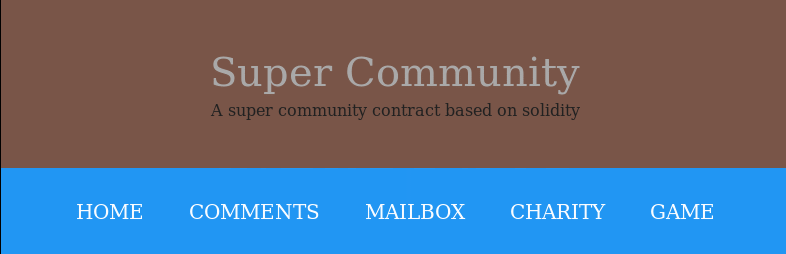

- 注册（按提示输入即可，Name字段是必须，其他可以不输）：  
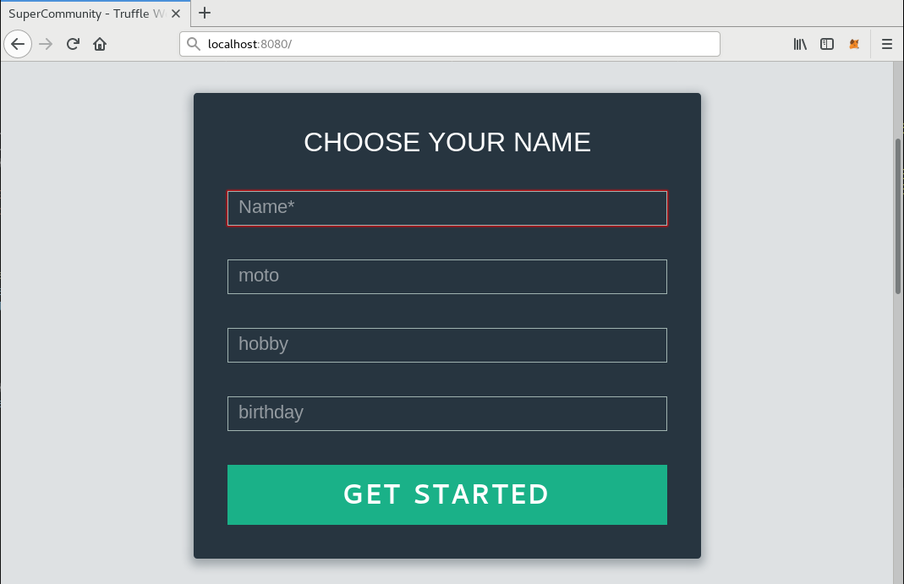  
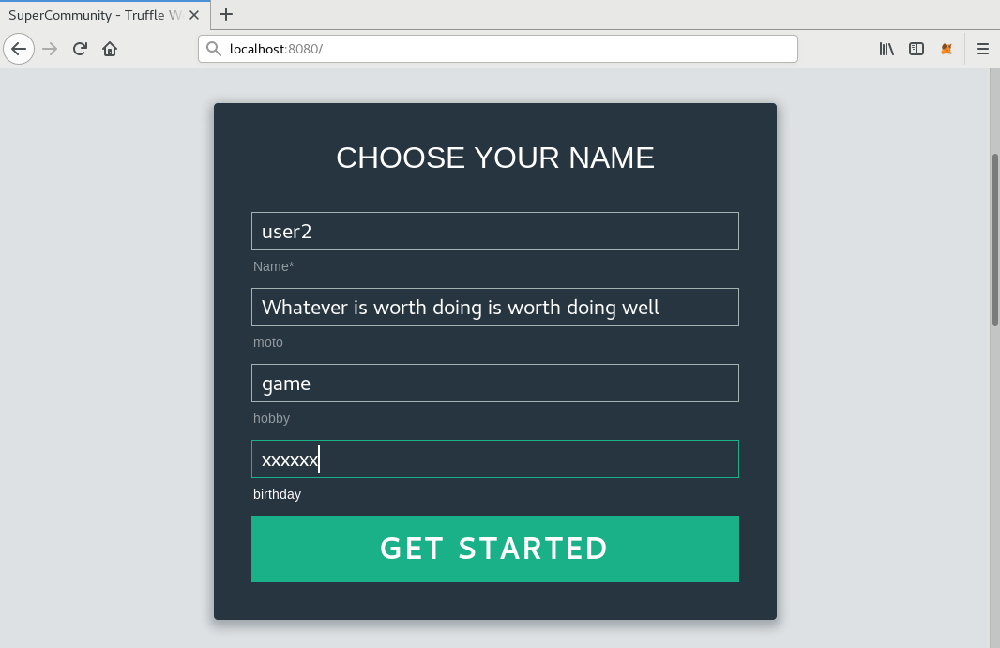  
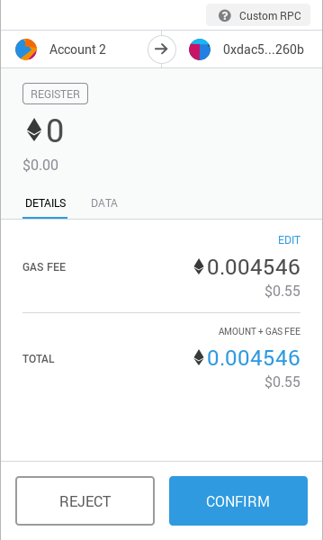  
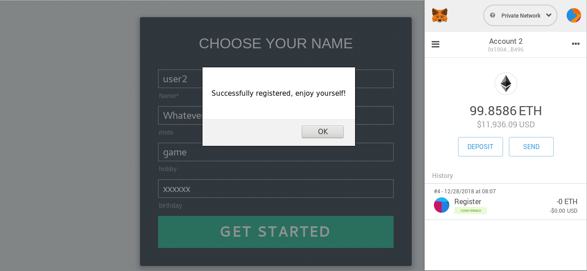

- **注册后该表单会被隐藏，只有未注册过的用户的页面才会显示该表单**
- 当前社区的评论列表。
    - Demo。（截该图时尚未实现发送评论区域的UI）
    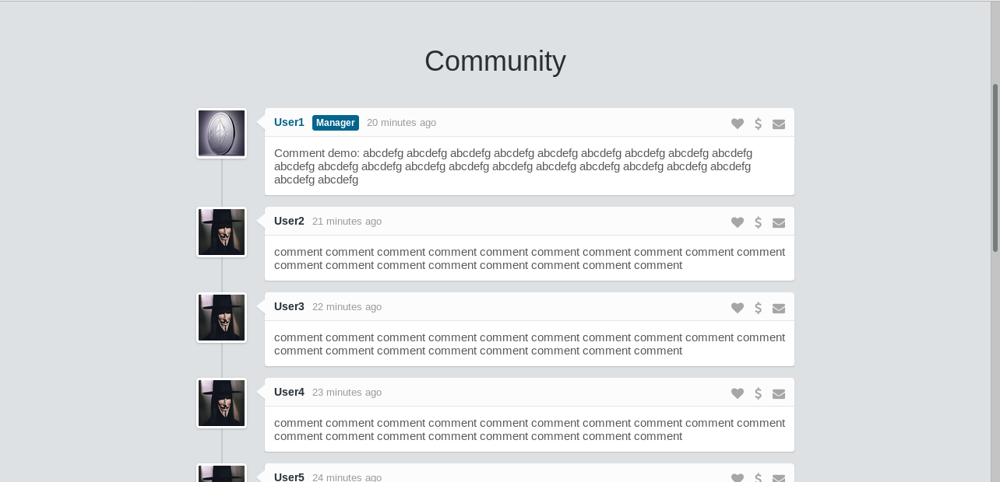

    - 实际测试结果（从区块链中获取评论数据）。
        - 初始没有评论时（最上面的是发送新评论的区域，右上角的按钮是发送按钮）。  
        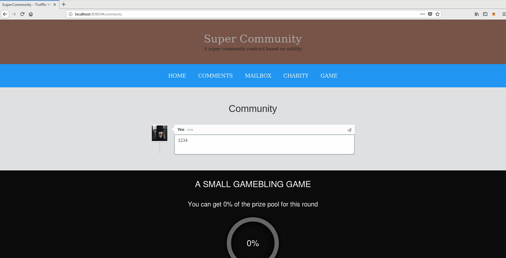  
        - 点击发送按钮发送评论（需提前注册），然后右上角会显示交易信息。  
        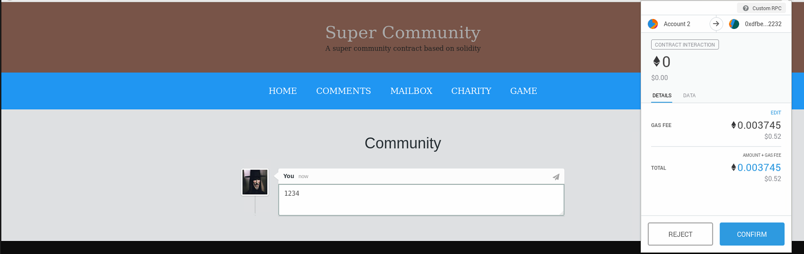
        - 确认交易，第一个发送评论的人成为manager。  
        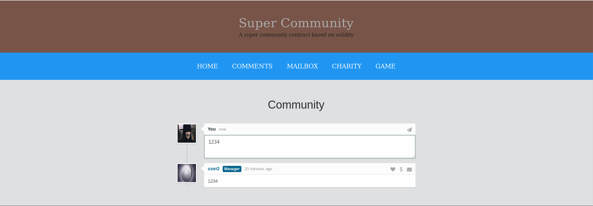
        - 切换 MetaMask 账户，注册一个新账户。  
        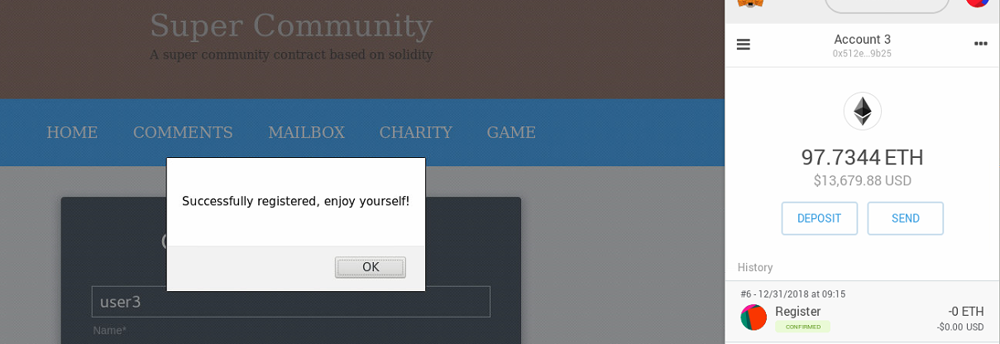
        - 用该用户进行评论测试。
        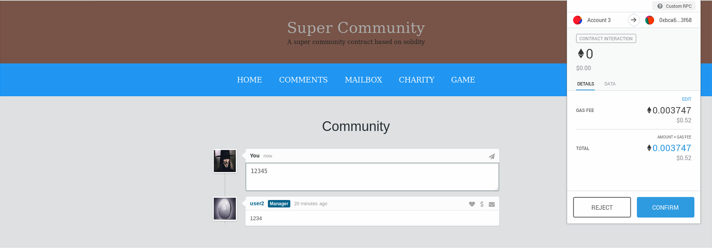
        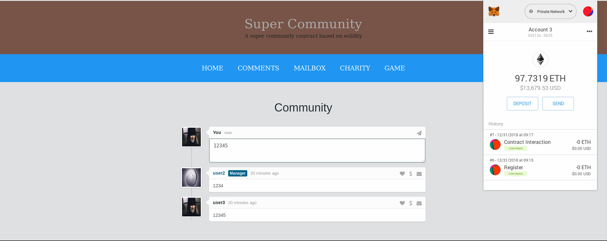
        - **测试结果符合预期**。
    - 下面的是评论的列表，每个列表右上角会有三个按钮：
        - 关注按钮进行关注。  
        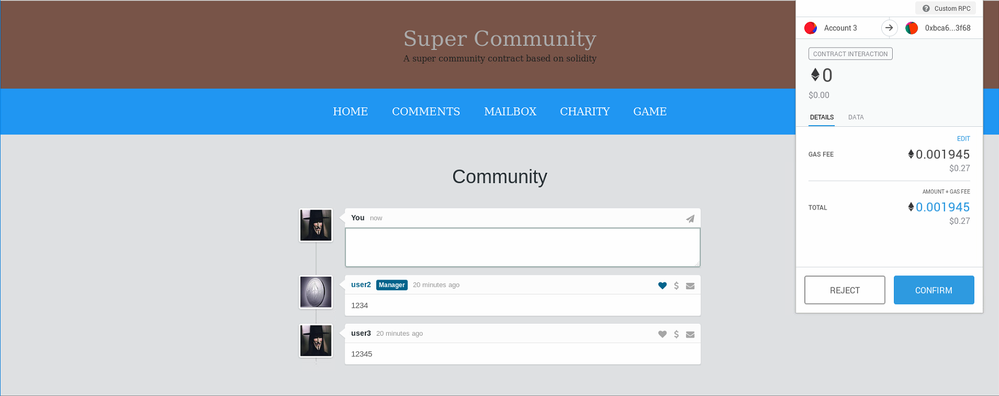
        - 打赏按钮进行打赏。会弹框提示输入打赏金额。  
        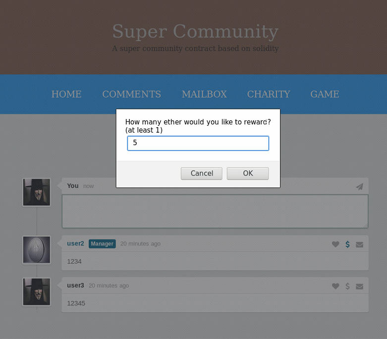  
        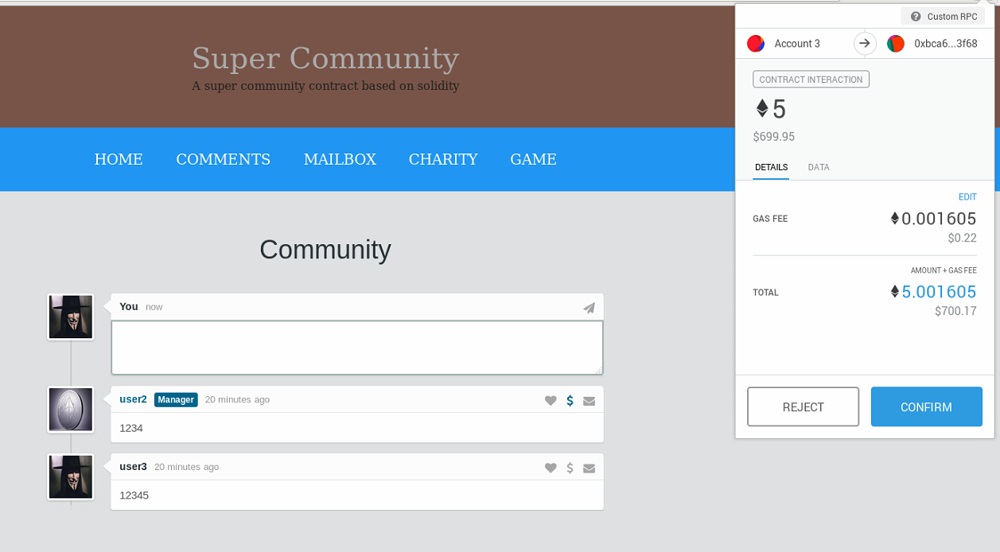  
        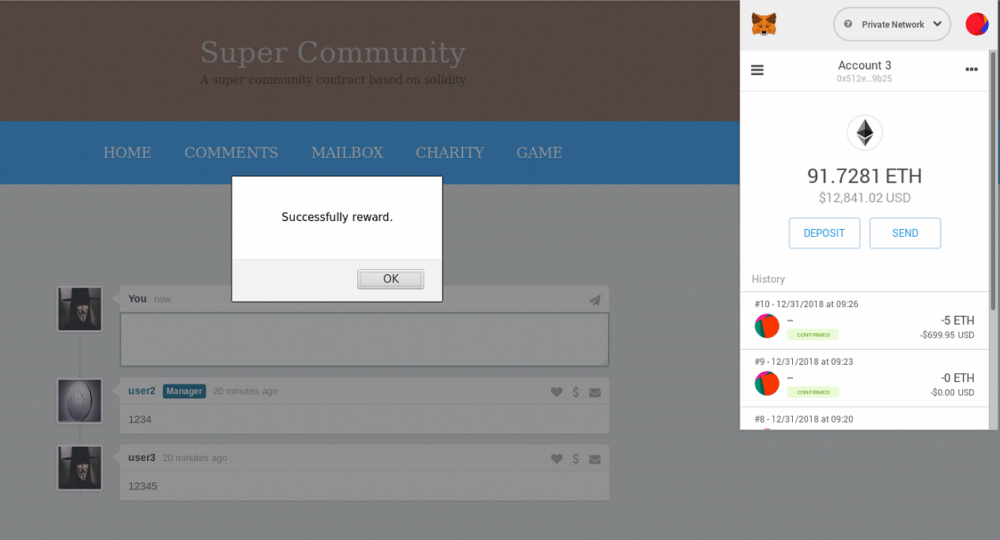        
        - 发送邮件。会弹框提示输入邮件标题和邮件正文。  
        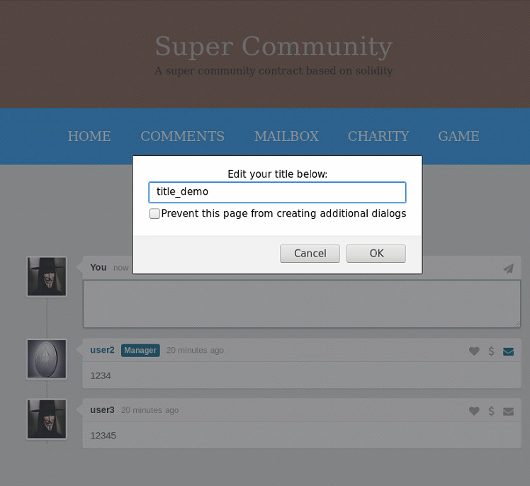  
          
        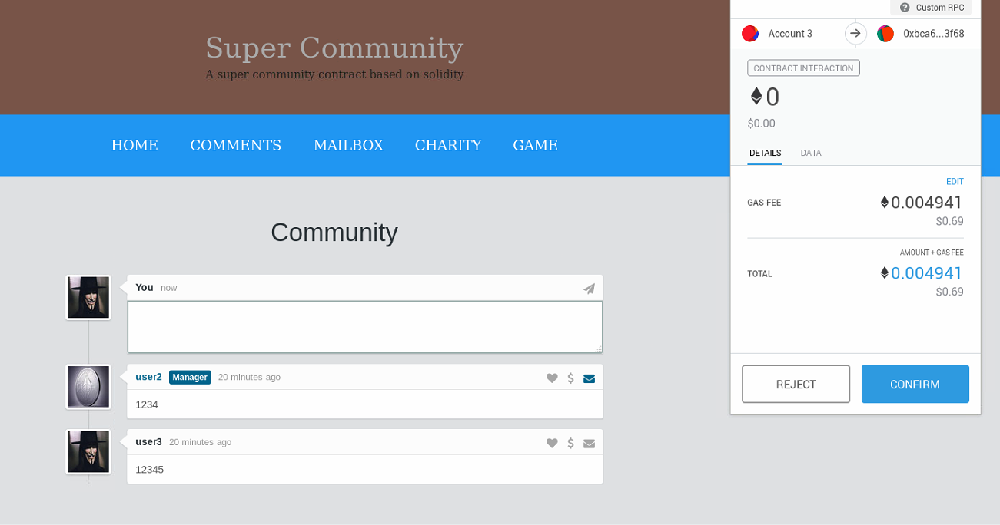
- 竞猜游戏（有动态效果无法展示）
    - 适合三个用户以上玩。
    - 玩游戏需要支付入场费（1 ether）。
    - 游戏每天一轮，每轮分为一二三等奖，按3:2:1瓜分奖池金额（奖池金额为参与者的入场费总和）。猜得越接近名次前。
    - 随机猜一个数字，如果没有获奖则显示0%，如果一等奖则50%，二等奖则33%，三等奖则16%。（在用户都不重复猜的情况下）
    - 实际是允许用户重复竞猜，这样就每个用户可能会有多条记录。
        - 前三名全是同一个用户那么则奖池金额100%归该用户。
        - 前三名有两个名是是同一个用户，那就要将各比例加起来作为该用户的奖金。比如83%就是用户占了第一名和第二名。

    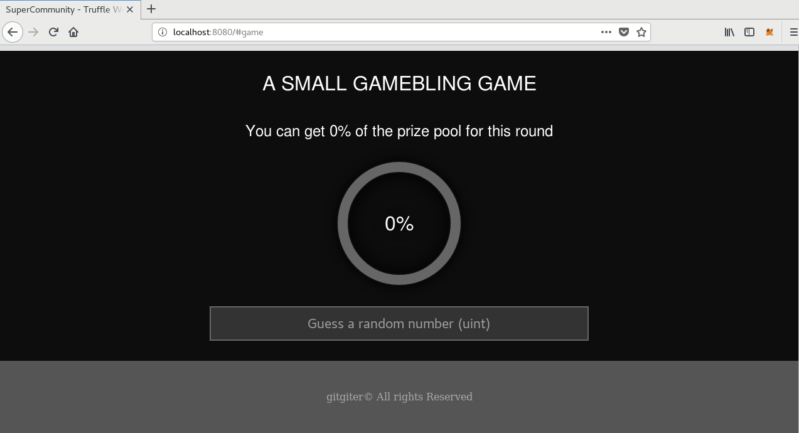  
    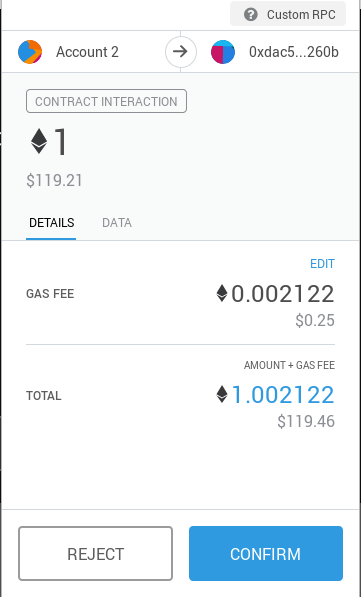  
    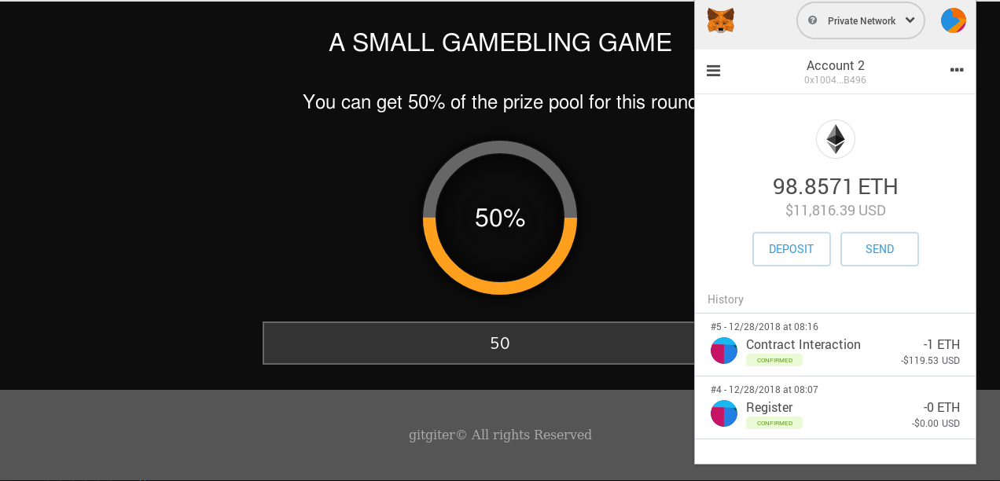  
    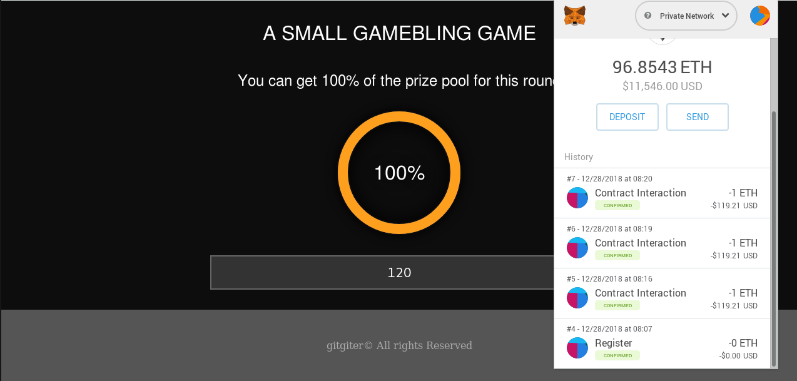  
    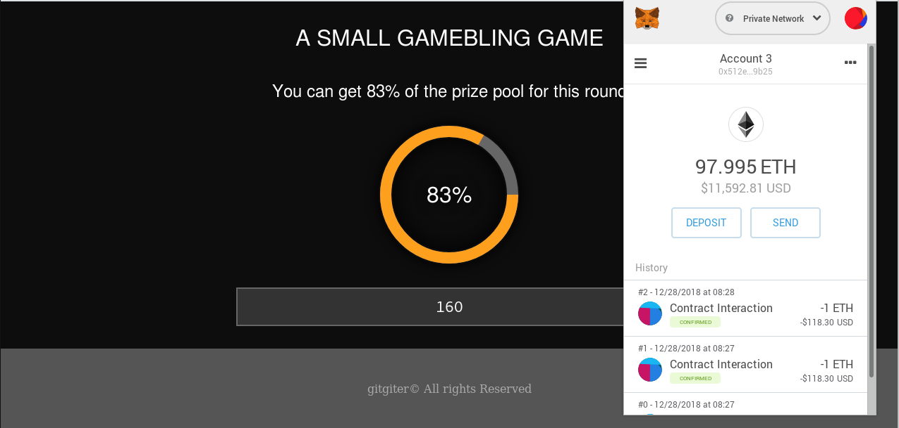

